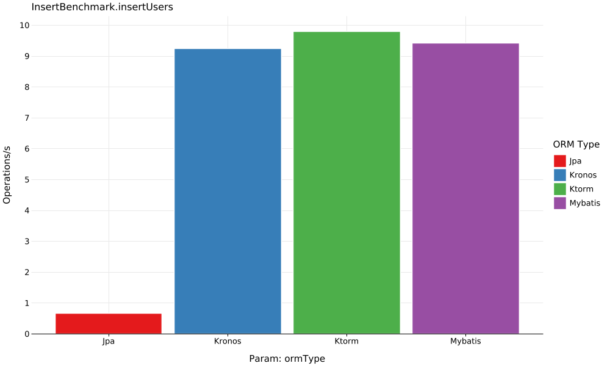
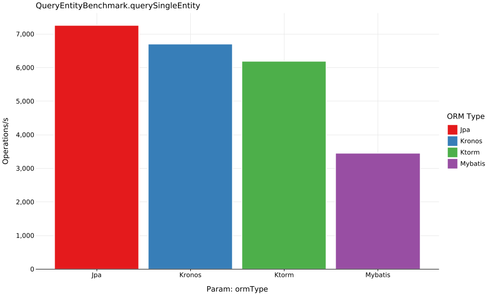
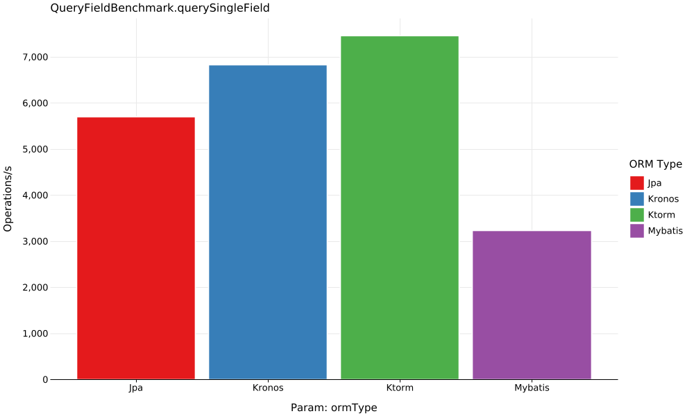
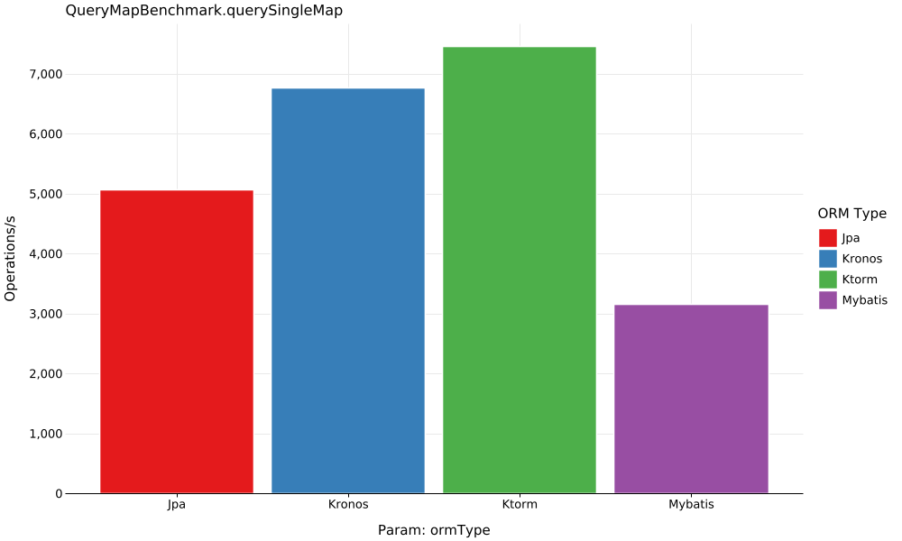

# Benchmark Report

## InsertBenchmark.insertUsers

| ORM Type | Counts | Score (ops/s) | Error (±) |
----------|--------|---------------|-----------|
 Ktorm | 10000 | 9.81 | ±0.16 |
 Mybatis | 10000 | 9.43 | ±0.17 |
 Kronos | 10000 | 9.26 | ±0.25 |
 Jpa | 10000 | 0.68 | ±0.00 |

---
## QueryEntityBenchmark.querySingleEntity

| ORM Type | Counts | Score (ops/s) | Error (±) |
----------|--------|---------------|-----------|
 Jpa | 100000 | 7,264.50 | ±310.52 |
 Kronos | 100000 | 6,699.26 | ±217.46 |
 Ktorm | 100000 | 6,191.73 | ±323.29 |
 Mybatis | 100000 | 3,451.82 | ±97.80 |

---
## QueryFieldBenchmark.querySingleField

| ORM Type | Counts | Score (ops/s) | Error (±) |
----------|--------|---------------|-----------|
 Ktorm | 100000 | 7,465.53 | ±234.11 |
 Kronos | 100000 | 6,826.51 | ±384.19 |
 Jpa | 100000 | 5,701.55 | ±115.01 |
 Mybatis | 100000 | 3,230.08 | ±154.53 |

---
## QueryMapBenchmark.querySingleMap

| ORM Type | Counts | Score (ops/s) | Error (±) |
----------|--------|---------------|-----------|
 Ktorm | 100000 | 7,463.69 | ±299.62 |
 Kronos | 100000 | 6,774.36 | ±307.45 |
 Jpa | 100000 | 5,071.59 | ±164.87 |
 Mybatis | 100000 | 3,165.63 | ±122.75 |

---
